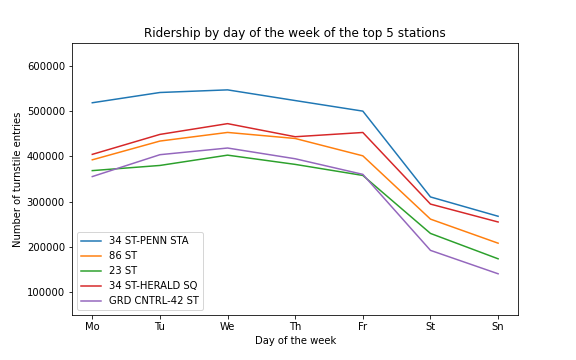
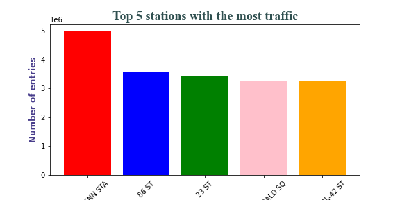

# EDA project MVP
---

- I utilized `pandas, matplotlib and seaborn` to extract information of the `MTA dataset` to get the top 5 stations with the most traffic in New York City.
- The 34 ST-PENN Station is the station which has the most traffic where in the last 17 weeks, it peaks 5 million ENTRIES; followed by 86 St station with a little over 3.5 million and 23 St station with over 3.4 million.
- It's being showed from the graph that we have more traffic on weekdays than weekends; and it's understandable since people don't work on weekends.